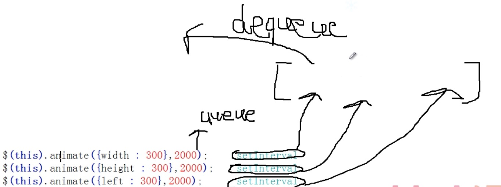

# part10.Queue-队列管理

针对多异步处理，比Deferred更强大。

    jQuery.extend({
      queue ---> push() 队列中添加
      dequeue ----> shift() 找到队列的第一个
      _queueHooks
    })

    jQuery.fn.extend({
        queue
        dequeue
        delay
        clearQueue
        promise
    })

**队列中存储的都是函数**

    function aaa(){
  		alert(1);
  	}

  	function bbb(){
  		alert(2);
  	}

    入队
    $.queue( document , 'q1' , aaa );
    $.queue( document , 'q1' , bbb );
    和
    $.queue( document , 'q1' , [aaa,bbb] );
    等价

    console.log(   $.queue( document , 'q1' )   );
    输出： (2) [ƒ, ƒ]

    出队（取出函数并且调用）
    $.dequeue( document,'q1' );   输出： aaa()执行
    $.dequeue( document,'q1' );   输出：bbb()执行

### 实例方法实现

    function aaa(){
  		alert(1);
  	}

  	function bbb(){
  		alert(2);
  	}

  	$(document).queue('q1',aaa);
  	$(document).queue('q1',bbb);

  	//console.log(  $(document).queue('q1')  );

  	$(document).dequeue('q1');
  	$(document).dequeue('q1');

## 队列在jQuery中作用

    #div1{
      width:100px;
      height:100px;
      background:red;
      position:absolute;
    }

    $(function(){
      $('#div1').click(function(){
    		$(this).animate({width : 300},2000);     setInterval
    		$(this).animate({height : 300},2000);    setInterval
    		$(this).animate({left : 300},2000);      setInterval
    	});
    })

  三个动画利用dequeue方式进行出对入队操作
  

#### Deferred VS queue
1. queue【多异步操作】 可以对同步和异步进行管理，重点是对异步进行管理，比deferred（deferred针对一个异步定时器）更强大，针对多个异步操作
2. queue主要针对animate

    #div1{
      width:100px;
      height:100px;
      background:red;
      position:absolute;
    }

    $(function(){
      $(this).animate({width : 300},2000).queue(function(next){
			$(this).css('height',300);
			next(); <==> $(this).queue();
		}).animate({left : 300},2000);
    })
