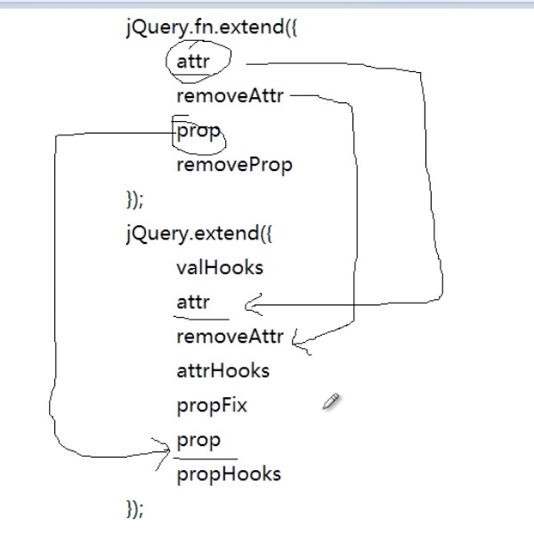

# part11.对元素属性操作.md

jQuery.fn.extend({

	attr
	removeAttr
	prop
	removeProp
	addClass
	removeClass
	toggleClass
	hasClass
	val

});

jQuery.extend({

  //一下方法基本内部用
	valHooks
	attr
	removeAttr
	attrHooks
	propFix
	prop
	propHooks

});

#### attr 、removeAttr 、prop 、removeProp

    $('#div1').attr('title','hello');
    alert( $('#div1').attr('id') );

    $('#div1').prop('title','hello');
    alert( $('#div1').prop('id') );

  **attr VS 、prop**

    原生设置属性的方法：
    1. setAttribute()
    2. . |  []

- **在jQuery中实现方式**

      $('#div1').attr('name','hello');
      $('#div1').attr('name');
      原生实现：
      document.getElementById('#div1').setAttribute('name','hello');
      document.getElementById('#div1').getAttribute('name');

      $('#div1').prop('name','hello');
      $('#div1').prop('name');
      原生实现：
      document.getElementById('#div1')[name] = 'hello';
      document.getElementById('#div1')[name];

- **主要区别是在设置自定义属性上面，attr可以prop不可**

      $('#div1').attr('miaov','妙味');
      $('#div1').prop('miaov','妙味');

      alert($('#div1').attr('miaov')); ==> 妙味
      alert($('#div1').prop('miaov')); ==> undefined
- attr用的多，prop用的很少

#### addClass 、removeClass

    $('div').addClass(function(index){
    	alert(index);
    	return 'box'+index;
    });

    $('#div1').addClass('box2 box3');  [box2 , box3]
    alert( 1 || 0 && 2 );   && > ||
    $('#div1').toggleClass('box2 box3',true);

    尽量不要用，没什么意义：
    $('#div1').toggleClass(false);
	  $('#div1').toggleClass(true);

#### val
