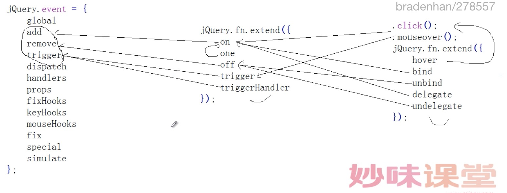

#part1.事件总说

    jQuery.event = {
    	global         事件的全局属性(源码还没用到)
    	add            绑定事件
    	remove         取消事件
    	trigger        主动触发事件
    	dispatch       配发事件的具体操作
    	handlers       函数执行顺序的操作
    	props          JQ中共享原生JS的event属性
    	fixHooks       收集event兼容的集合
    	keyHooks       键盘的event兼容
    	mouseHooks     鼠标的event兼容
    	fix            event对象的兼容处理
    	special        特殊事件的处理
    	simulate       focusin的模拟操作(trigger , dispatch)
    };

    jQuery.Event = function(){};
    jQuery.Event.prototype = {
    	isDefaultPrevented
    	isPropagationStopped
    	isImmediatePropagationStopped
    	preventDefault
    	stopPropagation
    	stopImmediatePropagation
    };

    jQuery.fn.extend({
    	on
    	one
    	off
    	trigger
    	triggerHandler
    });

    .click();
    .mouseover();
    jQuery.fn.extend({
    	hover
    	bind
    	unbind
    	delegate
    	undelegate
    });

**重点使用的是on、off、trigger**

**1. trigger VS triggerHandler**

**参数不同、都调用的是jQuery.event.trigger**

    trigger: function(type, data) {
			return this.each(function() {
				jQuery.event.trigger(type, data, this); // 2个参数
			});
		},
		triggerHandler: function(type, data) {
			var elem = this[0];
			if (elem) {
				return jQuery.event.trigger(type, data, elem, true); // 4个参数
			}
		}

**2. on VS one**

**one 调用的 on**

    one: function(types, selector, data, fn) {
    	return this.on(types, selector, data, fn, 1); //调用on
    },

**on调用的 jQuery.event.add**

    on: function(types, selector, data, fn, /*INTERNAL*/ one) {
        var origFn, type;

        // Types can be a map of types/handlers
        if (typeof types === "object") {
          // ( types-Object, selector, data )
          if (typeof selector !== "string") {
            // ( types-Object, data )
            data = data || selector;
            selector = undefined;
          }
          for (type in types) {
            this.on(type, selector, data, types[type], one);
          }
          return this;
        }

        if (data == null && fn == null) {
          // ( types, fn )
          fn = selector;
          data = selector = undefined;
        } else if (fn == null) {
          if (typeof selector === "string") {
            // ( types, selector, fn )
            fn = data;
            data = undefined;
          } else {
            // ( types, data, fn )
            fn = data;
            data = selector;
            selector = undefined;
          }
        }
        if (fn === false) {
          fn = returnFalse;
        } else if (!fn) {
          return this;
        }

        if (one === 1) {
          origFn = fn;
          fn = function(event) {
            // Can use an empty set, since event contains the info
            jQuery().off(event);
            return origFn.apply(this, arguments);
          };
          // Use same guid so caller can remove using origFn
          fn.guid = origFn.guid || (origFn.guid = jQuery.guid++);
        }
        return this.each(function() {
          //调用jQuery.event.add
          jQuery.event.add(this, types, fn, data, selector);

        });
      },

**3. off**

**调用的是jQuery.event.remove**

    off: function(types, selector, fn) {
    	var handleObj, type;
    	if (types && types.preventDefault && types.handleObj) {
    		// ( event )  dispatched jQuery.Event
    		handleObj = types.handleObj;
    		jQuery(types.delegateTarget).off(
    			handleObj.namespace ? handleObj.origType + "." + handleObj.namespace : handleObj.origType,
    			handleObj.selector,
    			handleObj.handler
    		);
    		return this;
    	}
    	if (typeof types === "object") {
    		// ( types-object [, selector] )
    		for (type in types) {
    			this.off(type, selector, types[type]);
    		}
    		return this;
    	}
    	if (selector === false || typeof selector === "function") {
    		// ( types [, fn] )
    		fn = selector;
    		selector = undefined;
    	}
    	if (fn === false) {
    		fn = returnFalse;
    	}
    	return this.each(function() {
        //调用jQuery.event.remove
    		jQuery.event.remove(this, types, fn, selector);
    	});
    },

### 归纳：

1. 事件中重点是：
    - jQuery.event.trigger //主动触发
    - jQuery.event.add //绑定
    - jQuery.event.remove //解绑
