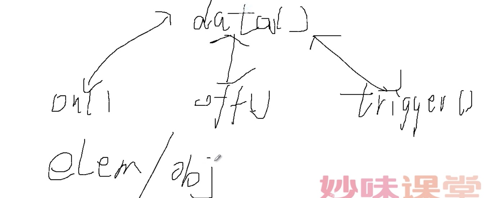

# add-remove-trigger详解

> ######使用方法

1. 主动触发

        $('#div1').on('click',function(){
        	alert(1);
        	$('#div1').off('click');
        });
        $('#div1').on('click',function(){
        		alert(2);
        })
        $('#div1').trigger('click'); ==> 1 2

2. 一些属性

        $('#span1').on('hide',function(){
        	alert(3);
        });
        $('#span1').on('hide',function(){
        	alert(4);
        });

        $('#span1').trigger('hide');

######函数和自定义事件的区别
- 函数重名会覆盖，自定义事件不会

### 原生JS实现 add、remove、trigger

- add、remove

    window.onload = function(){
    	var oDiv = document.getElementById('div1');
    	var oSpan = document.getElementById('span1');

    	var aaa = function(){
    		alert(1);
    	};

    	add(oDiv,'click',aaa); ==> 1
    	remove(oDiv,'click',aaa);
      };

      function add(obj,types,fn){
      	obj.addEventListener(types,fn,false);
      }
      function remove(obj,types,fn){
      	obj.removeEventListener(types,fn,false);
      }
- trigger

      window.onload = function(){
      	var oDiv = document.getElementById('div1');
      	var oSpan = document.getElementById('span1');

      	var aaa = function(){
      		alert(1);
      	};
      	var bbb = function(){
      		alert(2);
      	};
      	var ccc = function(){
      		alert(3);
      	};

      	add(oSpan,'show',aaa);
      	add(oSpan,'show',bbb);
      	add(oSpan,'hide',ccc);

      	remove(oSpan,'hide');

      	trigger(oSpan,'hide');  //

      };

      function add(obj,types,fn){

        // 此处思想很重要
      	obj.listeners = obj.listeners || {};
      	obj.listeners[types] = obj.listeners[types] || [];
      	obj.listeners[types].push(fn);

      	obj.addEventListener(types,fn,false);
      }
      function remove(obj,types,fn){
      	obj.removeEventListener(types,fn,false);

        //删除事件
      	delete obj.listeners[types];
      }
      function trigger(obj,types){
      	var arr = obj.listeners[types] || [];
      	for(var i=0;i<arr.length;i++){
      		arr[i]();
      	}
      }

      $('#div1').on('click',function(a){
      	alert(1);
      });
      $('#div1').on('click',function(b){
      alert(2);
      });
      $('#div1').on('tap',function(){
      	alert(3);
      });

    var elemData = {
    		events : {
    			'click' : [      //arr  arr.delegateCount 委托的个数  arr.length = 2
    				{},   //委托的(会放到前面),
    				{
    					data: undefined, //表示数据为为定义
    					guid: 3, // 当前事件的唯一表识
    					handler: function (){},// 绑定的函数
    					namespace: "", //命名空间
    					needsContext: undefined,
              //needsContext --- 有委托则为true（伪类情况‘:’）false(没有伪类情况)，没有委托则为undefined
    					origType: "click", //原始事件类型,
    					selector: "span",
    					type: "click" //真正事件类型
    				},
    				{}
    			],
    			'mouseover' : [
    				{}
    			]
    		},
    		handle : function(e){} //真正的事件函数
    	};

- #### namespace

- #### needsContext

- #### origType VS type

