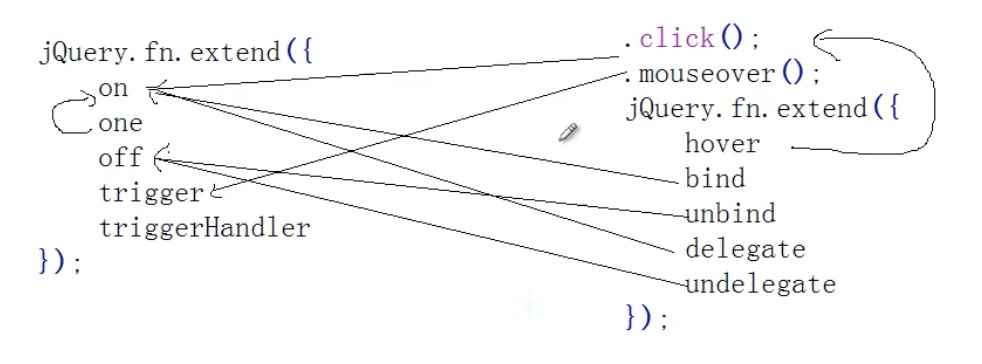
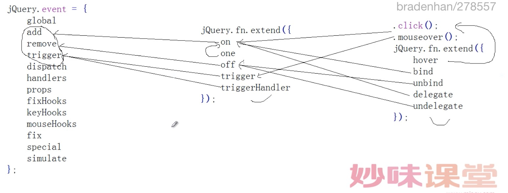

#part12.事件操作

    jQuery.event = {
    	global         事件的全局属性(源码还没用到)
    	add            绑定事件
    	remove         取消事件
    	trigger        主动触发事件
    	dispatch       配发事件的具体操作
    	handlers       函数执行顺序的操作
    	props          JQ中共享原生JS的event属性
    	fixHooks       收集event兼容的集合
    	keyHooks       键盘的event兼容
    	mouseHooks     鼠标的event兼容
    	fix            event对象的兼容处理
    	special        特殊事件的处理
    	simulate       focusin的模拟操作(trigger , dispatch)
    };

    jQuery.Event = function(){};
    jQuery.Event.prototype = {
    	isDefaultPrevented
    	isPropagationStopped
    	isImmediatePropagationStopped
    	preventDefault
    	stopPropagation
    	stopImmediatePropagation
    };

    jQuery.fn.extend({
    	on
    	one
    	off
    	trigger
    	triggerHandler
    });

    .click();
    .mouseover();
    jQuery.fn.extend({
    	hover
    	bind
    	unbind
    	delegate
    	undelegate
    });*/

