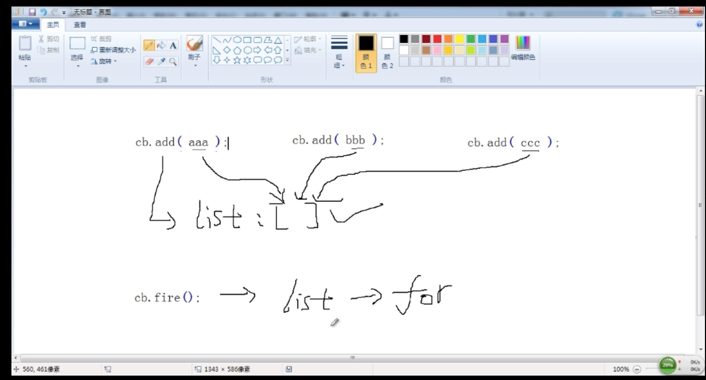
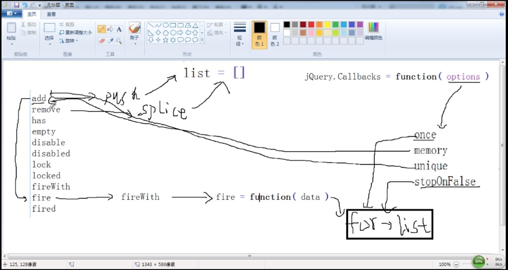

## part5-Callbacks:回调对象--对函数的统一管理.md

    jQuery.Callbacks = function(options) {
        once 只执行一次
        var cb = $.Callbacks('once');
        
        memory 记忆
        var cb = $.Callbacks('memory'); 
        
        unique 去重
        var cb = $.Callbacks('unique'); 
        
        stopOnFalse 
        var cb = $.Callbacks('stopOnFalse');
        
         var cb = $.Callbacks('once stopOnFalse'); 
 

        add()
        remove()
        has()
        empty()
        disable()
        disabled()
        lock()
        locked()
        fireWith()
        fire()
        fired()
    }

### 例子基本使用

    $(function(){ 
    	function aaa () {
    		alert(1)
    	}
    
    	function bbb (){
    		alert(2)
    	}
    
    	var cb = $.Callbacks();
    
    	cb.add(bbb);
    	cb.add(aaa);
    	
    	cb.add(bbb，aaa); 和上面两句一样意义
    	cb.fire();
    })
    
  例子2:
    
    $(function(){
        var cb = $.Callbacks();

    	function aaa () {
    		alert(1)
    	} 
    	cb.add(aaa);
    
    	(function(){
    		function bbb (){
    			alert(2)
    		} 
    
    		cb.add(bbb);
    	})()  
    	
    	cb.fire();
    })

### 方法集合

    callbacks.add()
    回调列表中添加一个回调或回调的集合。
    
    callbacks.disable()
    禁用回调列表中的回调
    
    callbacks.disabled()
    确定回调列表是否已被禁用。
    
    callbacks.empty()
    从列表中删除所有的回调.
    
    callbacks.fire()
    用给定的参数调用所有的回调
    
    callbacks.fired()    
    访问给定的上下文和参数列表中的所有回调。
    
    callbacks.fireWith()
    访问给定的上下文和参数列表中的所有回调。
    
    callbacks.has()
    确定列表中是否提供一个回调
    
    callbacks.lock()
    锁定当前状态的回调列表。
    
    callbacks.locked()
    确定回调列表是否已被锁定。
    
    callbacks.remove()
    从回调列表中的删除一个回调或回调集合。
    
    jQuery.Callbacks()
    一个多用途的回调列表对象，提供了强大的的方式来管理回调函数列表。
