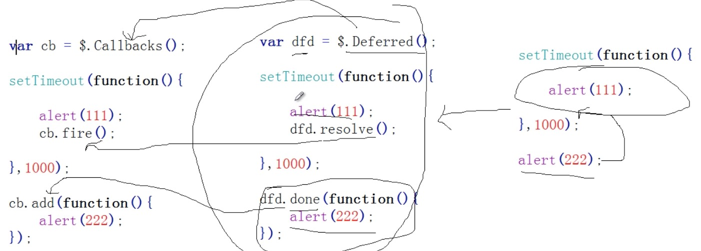
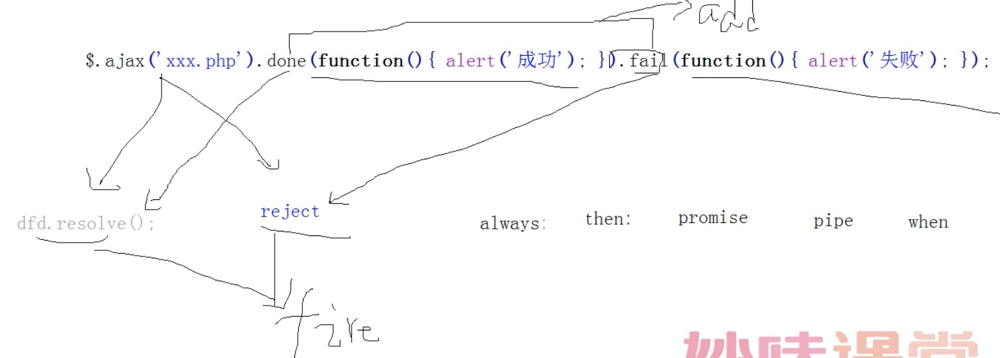
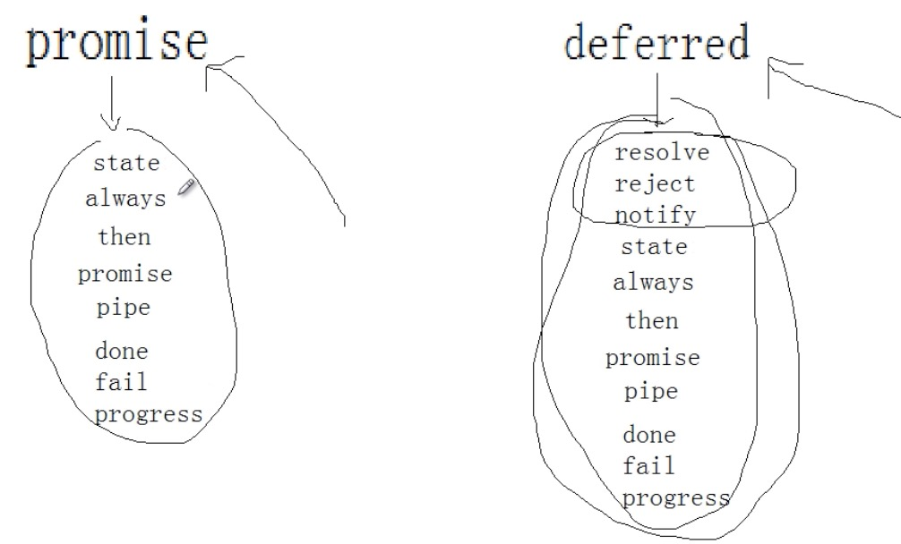
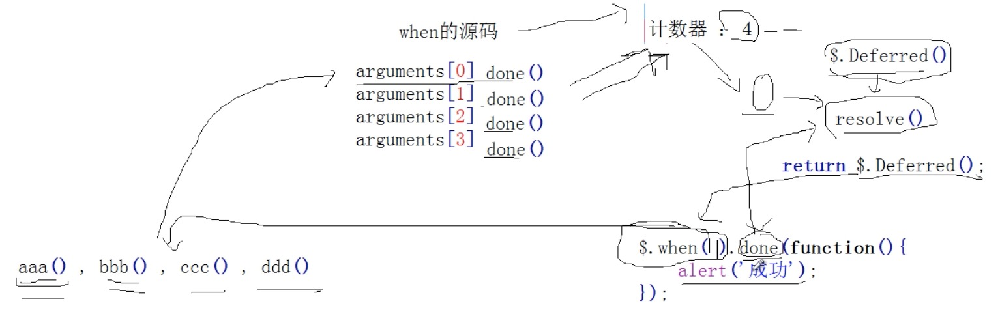

# part7-Deferred-延迟对象-对异步的统一管理 (定时器、ajax)

## Deferred 主要方法

- deferred.always() 
  当Deferred（延迟）对象解决或拒绝时，调用添加处理程序。

- deferred.catch()
  当Deferred对象被拒绝(reject)时，调用添加的处理程序。

- deferred.done()
  当Deferred（延迟）对象解决时，调用添加处理程序。

- deferred.fail()
  当Deferred（延迟）对象拒绝时，调用添加处理程序。

- deferred.isRejected()
  确定一个Deferred（延迟）对象是否已被拒绝。

- deferred.isResolved()
  确定一个Deferred（延迟）对象是否已被解决。

- deferred.notify()
  根据给定的 args参数 调用Deferred（延迟）对象上进行中的回调 （progressCallbacks）。

- deferred.notifyWith()
  根据给定的上下文（context）和args递延调用Deferred（延迟）对象上进行中的回调（progressCallbacks ）。

- deferred.pipe()
  实用的方法来过滤 and/or 链Deferreds。

- deferred.progress()
  当Deferred（延迟）对象生成进度通知时，调用添加处理程序。

- deferred.promise()
  返回Deferred(延迟)的Promise（承诺）对象。

- deferred.reject()
  拒绝Deferred（延迟）对象，并根据给定的args参数调用任何失败回调函数（failCallbacks）。

- deferred.rejectWith()
  拒绝Deferred（延迟）对象，并根据给定的 context和args参数调用任何失败回调函数（failCallbacks）。

- deferred.resolve()
  解决Deferred（延迟）对象，并根据给定的args参数调用任何完成回调函数（doneCallbacks）。

- deferred.resolveWith()
  解决Deferred（延迟）对象，并根据给定的 context和args参数调用任何完成回调函数（doneCallbacks）。

- deferred.state()
  确定一个Deferred（延迟）对象的当前状态。

- deferred.then()
  当Deferred（延迟）对象解决，拒绝或仍在进行中时，调用添加处理程序。

- jQuery.Deferred()
  一个构造函数，返回一个链式实用对象方法来注册多个回调，回调队列， 调用回调队列，并转达任何同步或异步函数的成功或失败状态。

- jQuery.when()
  提供一种方法来执行一个或多个对象的回调函数， Deferred(延迟)对象通常表示异步事件。

**详细解析**

    jQuery.extend({     
        Deferred : function(){},
        when : function(){}
    });

**调用**

* $.Deferred();
* $. when();

## Deferred()
  
    $.Deferred() --> $.callbacks();

#### 复习$.callbacks();

    var cb = $.Callbacks();     
    setTimeout(function(){
     alert(111);
     cb.fire(); 
    },1000)
    
    cb.add(function(){
    	alert(222)
    });     
    结果： 
    111
    222
    
    var dfd = $.Deferred(); 
    setTimeout(function(){
     alert(111);
     dfd.resolve(); 
    },1000)
    
    dfd.done(function(){
    	alert(222)
    });
    结果： 
    111
    222

老版：

    $.ajax({
    	url: '/path/to/file',
    	success : function(){
    		alert('成功');
    	},
    	fail : function(){
    		alert('失败');
    	}
    })

改进版

    $.ajax({
    	url: '/path/to/file',
    	type: 'default GET (Other values: POST)',
    	dataType: 'default: Intelligent Guess (Other values: xml, json, script, or html)',
    	data: {param1: 'value1'},
    }).done(function() {
    	console.log("success");
    }).fail(function() {
    	console.log("error");
    }).always(function() {
    	console.log("complete");
    });
    

    var dfd = $.Deferred(); 
    setTimeout(function(){ 
     dfd.reject(); 
    },1000)
    
    dfd.done(function(){
    	alert(222)
    }).fail(function(){
    	alert(333);
    });
    
.
    
    var dfd = $.Deferred(); 
    setInterval(function(){
    	alert(111)
    	// dfd.resolve();  
        //  dfd.reject();
        dfd.notify();
    },1000)
    
    dfd.done(function(){
    	alert('成功')
    }).fail(function(){
    	alert('失败');
    }).progress(function(){
    	alert('进度中');
    });
    
.
    
    var cb = $.Callbacks('memory');
    cb.add(function(){
    	alert(1)
    });
    
    cb.fire();
    
    cb.add(function(){
    	alert(2)
    });

#### promise 与 deferred

    // Make the deferred a promise
    promise.promise(deferred);
    
    promise = {
        ... ,
    	// Get a promise for this deferred
    	// If obj is provided, the promise aspect is added to the object
    	promise: function(obj) {
    		return obj != null ? jQuery.extend(obj, promise) : promise;
    	}
    },

 - promise
    - state
.
 
            function aaa (){
            	var dfd = $.Deferred();
            	alert(dfd.state())
            	setTimeout(function(){
            		dfd.resolve();
            		alert(dfd.state())
            	},1000)             	
            	return dfd.promise()
            }
            
            
            var newDfd = aaa ();
            
            newDfd.done(function(){
            	alert('成功')
            }).fail(function(){
            	alert('失败');
            }).progress(function(){
            	alert('进度中');
            });

    - always

    
    
    - then 参数(fnDone, fnFail, fnProgress)
    
             dfd.then(function(){
                // 成功回调
             },function(){
                // 失败回调
             },function(){
                // 进度回调
             })
             
              var dfd = $.Deferred();
              setTimeout(function(){
                	dfd.resolve('hi'); 
                },1000);
                var newDfd = dfd.pipe(function(){
                	return arguments[0] + 'sss';  
               });
                newDfd.done(function(){
                	alert(arguments[0])
                });
    
    - promise

 - deferred

- apply()方法
  function.apply(thisObj[, argArray])

- call()方法
  function.call(thisObj[, arg1[, arg2[, [,...argN]]]]);

## when 主要方法

**使用**

    $.when().done(); //参数一定得是延迟对象，否则会有问题
    
    $.when( { testing: 123 } ).done(
        function(x) { alert(x.testing); } /* alerts "123" */
    );
    
    $.when( $.ajax("test.aspx") ).then(function(data, textStatus, jqXHR){
        alert( jqXHR.status ); // alerts 200
    });

** when 和 Deferred 的 区别：**

    var dfd = $.Deferred();
    dfd.done(); //对一个延迟对象
    
    $.when().done(); // 对多个延迟对象

.

    function aaa(){
    	var dfd = $.Deferred();
    	dfd.resolve();
    	return dfd;
    }
    
    aaa().done(function(){
    	alert('成功');
    });
    结果： ---> 成功
    --------------------- 
    
    function aaa(){
    	var dfd = $.Deferred();
    	dfd.resolve(); // 完成
    	return dfd;
    }  
    
    function bbb(){
    	var dfd = $.Deferred();
    	dfd.reject(); //失败
    	return dfd;
    }
    
    $.when( aaa() , bbb() ).done(function(){
    	alert('成功');
    }).fail(function(){
    	alert('失败');
    });
    
    结果： ---> 失败

when()源码解析图：

