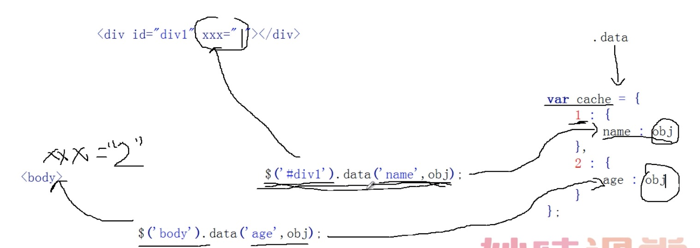
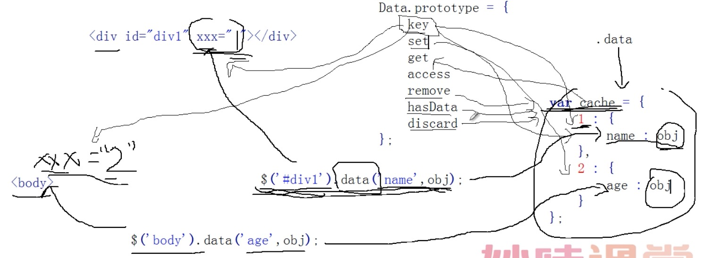

#part9-data() 数据缓存

例子：

    $('#div1').attr('name','hello');
  	$('#div1').attr('name');
    原生实现：
    document.getElementById('#div1').setAttribute('name','hello');
	document.getElementById('#div1').getAttribute('name');

  	$('#div1').prop('name','hello');
  	$('#div1').prop('name');
    原生实现：
    document.getElementById('#div1')[name] = 'hello';
	document.getElementById('#div1')[name];

  	$('#div1').data('name','hello');
  	$('#div1').data('name');

    效果一样

**内存泄漏：**

DOM元素与对象之间相互引用，大部分浏览器就会出现内存泄漏

    var oDiv = document.getElementById('#div1');
  	var obj = {};
  	oDiv.name = obj;
  	obj.age = oDiv;

# Data()简介
jQuery.extend({

    acceptData

    hasData()
    例子：
    $(function(){  
      $.data(document.body,'name','sss');
      $.hasData(document.body,'name'); ==> true
      $.removeData(document.body,'name');
      $.hasData(document.body,'name'); ==> false
    })

    data()
    removeData()
    例子：
    $(function(){  
    	$.data(document.body,'name','sss');
    	$.data(document.body,'name'); ==> sss

    	$.data(document.body,'name','sss');
    	$.removeData(document.body,'name');
    	$.data(document.body,'name'); ==> undefined
    })

    _data() (内部接口)
    _removeData()  (内部接口)

})

jQuery.fn.extend({

    data()
    removeData()

    例子：
    $(function(){  
      $('#div1').data('name','hello');
    	$('#div1').data('name'); ==> hello

    	$('#div1').data('name','hello');
    	$('#div1').removeData('name');
    	$('#div1').data('name'); ==> undefined
    })
})

## Data()对象原型

Data.prototype = {

    key()
    set()
    get()
    access()
    remove()
    hasData()
    discard()

}

最终流程图：

例子：

    var obj = {
  		name : "hello"
  	}

  	Object.freeze(obj) // 禁止修改对象的属性

    Object.defineProperty(obj, 0, { // jQuery源码方法
  		get: function() {
  			return {};
  		}
  	});

  	obj.name = "ss"
  	console.log(obj.name)
    结果：
    hello

    $.removeData(document.body , ['nage','age'])
    $.removeData(document.body , 'nage')

jQuery思想：  
对于一组元素进行设置操作，会设置一组中所有元素，
对于一组元素中进行获取操作，好多方法只会获取第一个元素。

    jQuery.fn.extend({
        data:
        removeData:
    });

#### dataset HTML5属性

    
aaaa

    alert($('#div1').get(0).dataset.miaovAll);

--------------

    $('#div1').data('nameAge','hi');
  	$('#div1').data('name-age','hello');

  	this.cache = {
  		1 : {
  			'nameAge' : 'hello',
  			'name-age' : 'hello'
  		}
  	}
